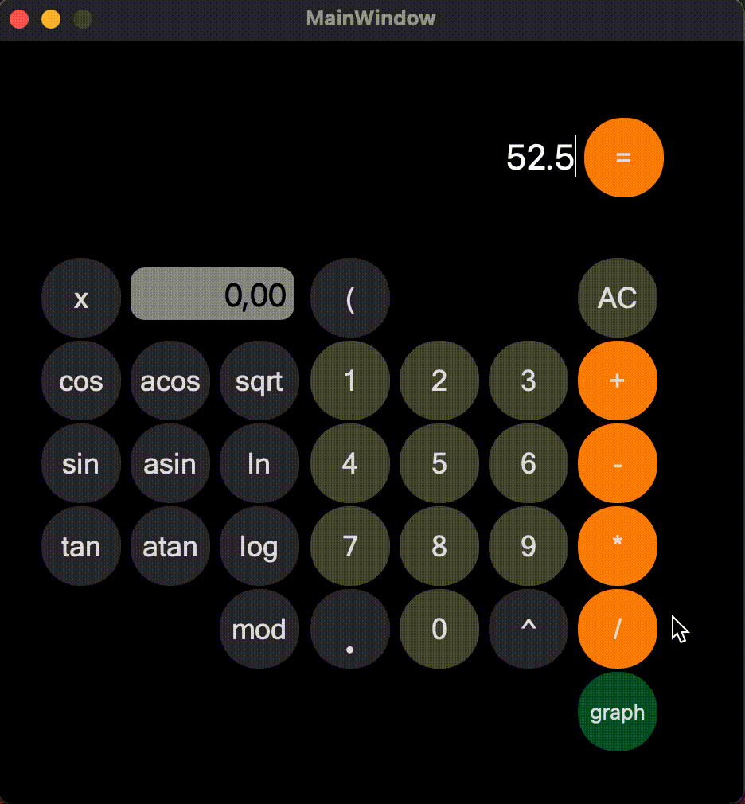

# Table of contents


1. [CPP Calc](#CPP_Calc)
2. [Installation](#installation)
3. [Samples](#sample-of-usage)
4. [Contributing](#contributing)


# CPP_Calc

CPP_Calc is a program capable of calculating an equation while maintaining order (the expressions in the brackets are calculated first etc...). If an equation contains an X, CPP_Calc has an ability to calculate a graph. 


# Installation

Supported systems:
 


For installation you need to open directory `src` in terminal and write command

```bash
make install
```

After this CPP_Calc will be installed to your desktop

# Sample of usage

1. Calculate any equation.




2. Calculate graph.


## Contributing

Pull requests are welcome. For major changes, please open an issue first
to discuss what you would like to change.

Please make sure to update tests as appropriate.